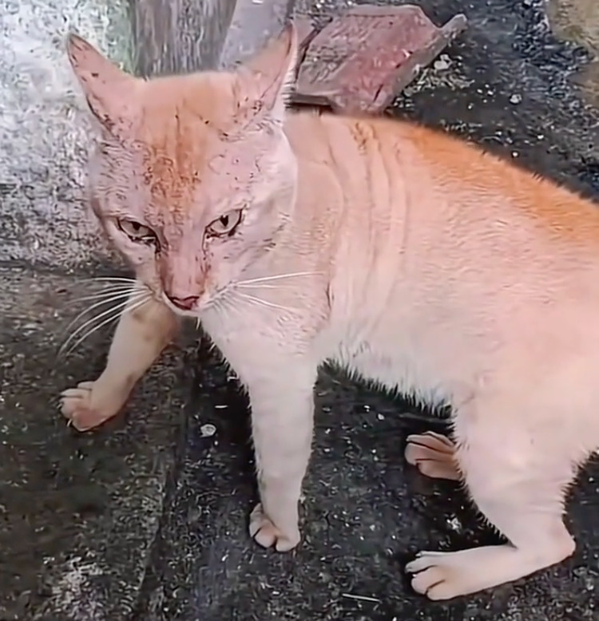
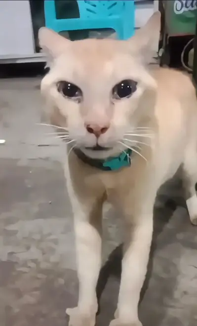

# 丑橘.skill：我庆幸自己只是弱小，而不是懦弱

<p align="center">
  
</p>

<p align="center"><em>第一张：力量可以弱小，姿态不能后退。</em></p>

<p align="center">
  
</p>

<p align="center"><em>第二张：眼里可以有泪，心里不能有降。</em></p>

<p align="center"><strong>致敬丑橘精神：弱小，但不软弱；害怕，却不后退。</strong></p>

> “我庆幸自己只是弱小，而不是懦弱。”

## 致敬丑橘精神

丑橘没有庞大的身躯，也没有压倒性的力量。它会害怕，会流泪，会在强大的对手面前显得微不足道。

但弱小从来不等于懦弱，恐惧也不等于退缩。

真正的勇敢，不是毫无畏惧，而是明知力量悬殊，仍然站稳脚步、直视威胁；不是确信自己一定会赢，而是即使可能失败，也不把尊严交出去。

它或许赢不了每一场战斗，但它始终可以选择：**不逃避、不屈服、不背过身去。**

谨以这个项目致敬丑橘，也致敬每一个身处劣势、心怀恐惧，却依然选择向前一步的人。

## 关于这个 Skill

`chouju` 用两张具有严格连续性的电影感图像，讲述“弱者面对强者，却死战不退”的故事：

1. 第一张建立强弱悬殊的正面对峙；
2. 第二张继承相同角色、场景、光线与空间方向，聚焦弱者克制恐惧、坚定迎战的瞬间。

这里的“弱”，只是力量与尺度上的劣势，不是畸形、无能或任人摆布。弱者可以疲惫，可以受伤，可以流泪，但仍然拥有意志、尊严和选择。

## 使用方式

```text
使用 $chouju 生成一组强弱对峙与弱方不屈特写的连续双图。
```

也可以直接描述双方与场景，例如：

```text
使用 $chouju 生成一组麻雀与游隼在暴雨屋顶对峙的连续双图，
第二张只保留麻雀，表现它害怕、疲惫但死战不退。
```

---

<p align="center"><strong>弱小是处境，懦弱才是选择。</strong></p>
